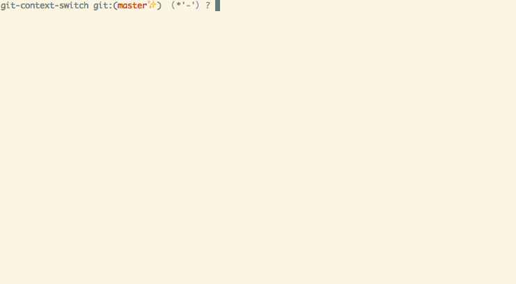

# git-context-switch

*git-context-switch is a context switch for git*

git-context-switch makes git able to manage multiple branch-lists and stash-lits (called "context").

## Demo



## Dependencies

Emacs (>=24), as an interpreter.

## Installation

Make `git-context-switch.el` executable visible from PATH

```
cp git-context-switch.el /usr/local/bin/git-context-switch
chmod +x /usr/local/bin/git-context-switch
```

and (optionally) add an alias to `~/.gitconfig`.

```
[alias]
context = "!f() { git-context-switch $*; }; f"
```

## Usage

git-context-switch have following subcommands:

* `git context` ... Show current context name
* `git context list` ... Show list of all all contextsx.
* `git context create <name>` ... Create new context.
* `git context delete <name>` ... Delete context.
* `git context switch <name>` ... Switch to context.
* `git context show <name>` ... Show list of branches.
* `git context mv <branch> <context>` ... Move branch to context.
* `git context cp <branch> <context>` ... Copy branch to context.

`mv` and `cp` commands accept following arguments in addition:

* `mv foo-context:foo-branch bar-context` ... Specify context to move (copy) branch from
* `mv foo-branch bar-context:foofoo-branch` ... Specify branch name to move (copy) to
